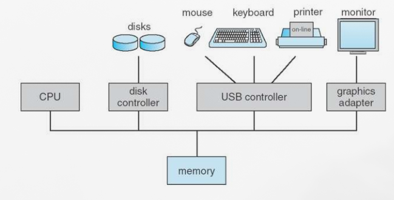

# Computer System Organization
- One or more CPUs, device controllers connect through common bus providing access to shared memory.
- Concurrent execution of CPUs and devices competing for memory cycles.

