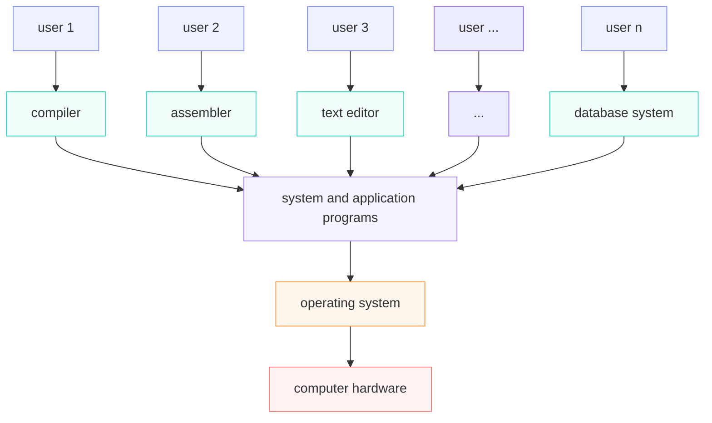

```mermaid
%% start of mermaid

graph TB
    user1[user 1]
    user2[user 2]
    user3[user 3]
    user4[user ...]
    usern[user n]
    
    compiler[compiler]
    assembler[assembler]
    textEditor[text editor]
    dummy[...]
    database[database system]
    
    sysApps[system and application programs]
    os[operating system]
    hardware[computer hardware]
    
    user1 --> compiler
    user2 --> assembler
    user3 --> textEditor
    user4 --> dummy
    usern --> database
    
    compiler --> sysApps
    assembler --> sysApps
    textEditor --> sysApps
    dummy --> sysApps
    database --> sysApps
    
    sysApps --> os
    os --> hardware
    
    classDef userLayer stroke:#818cf8,fill:#eef2ff
    classDef appLayer stroke:#2dd4bf,fill:#f0fdfa
    classDef sysLayer stroke:#a78bfa,fill:#f5f3ff
    classDef osLayer stroke:#fb923c,fill:#fff7ed
    classDef hwLayer stroke:#f87171,fill:#fef2f2
    
    class user1,user2,user3,usern userLayer
    class compiler,assembler,textEditor,database appLayer
    class sysApps sysLayer
    class os osLayer
    class hardware hwLayer

  
%% end of mermaid
```

