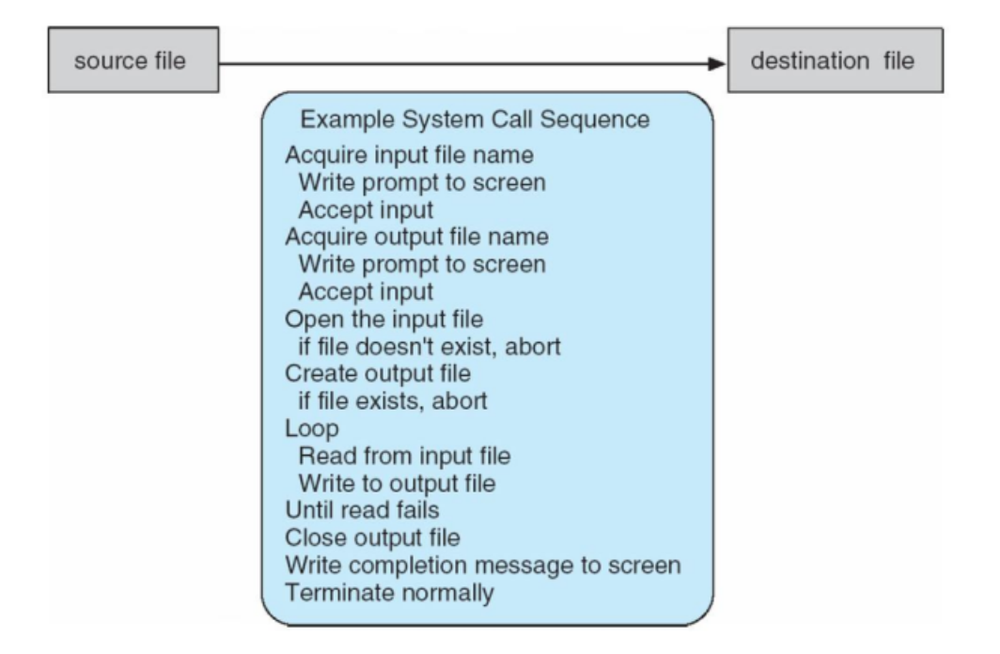
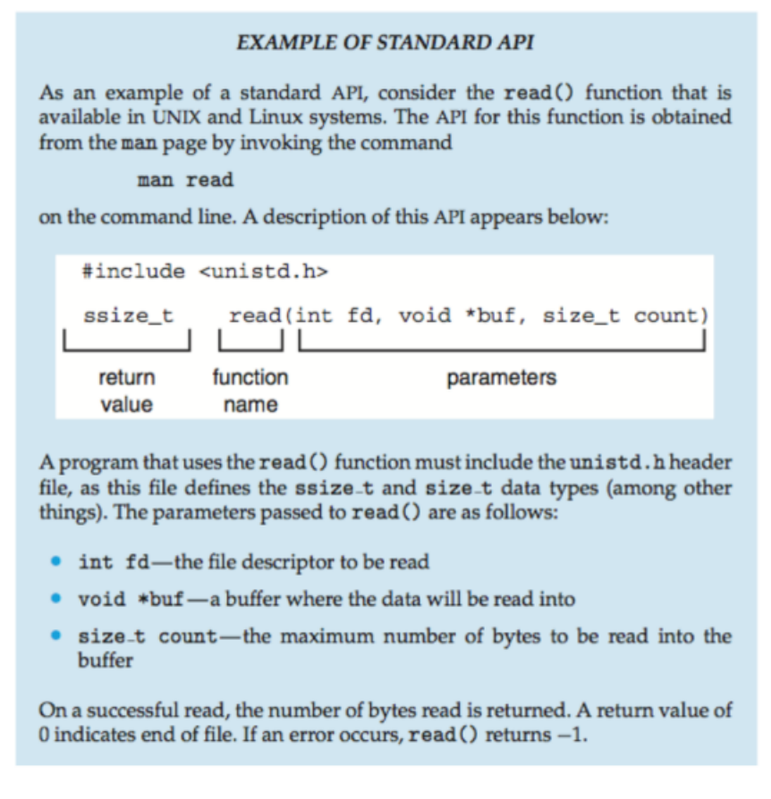

# System Calls
- Programming interface to the services provided by the OS
- Typically written in a high level language (C or C++)
- Mostly access by programs via a high-level **Application Programming Interface (API)** rather than direct system call use
- Three most common APIs are Win32 API for Windows, POSIX API for POSIX-based systems (including virtually all versions of UNIX, Linux, Mac OS X), and Java API for the Java Virtual Machine (JVM)

Note that the system-call names used throughout this text are generic

- Example of System Calls:
    - System call sequence to copy the contentse of one file to another file
        - 

- Example of Standard API:
    - 

