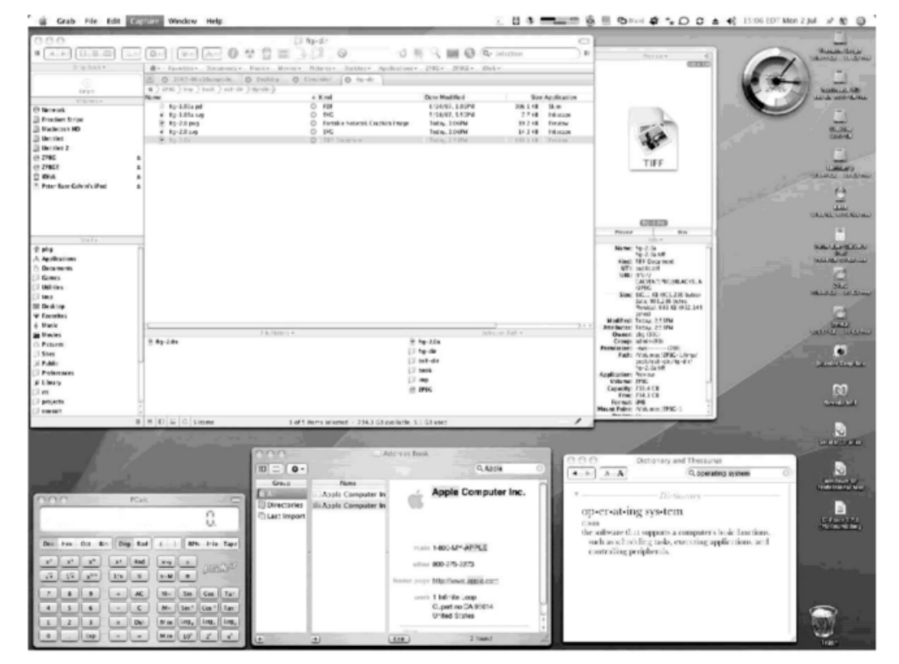

# User Operating System Interface - GUI
- User friendly **desktop** metaphor interface
    - Usually mouse, keyboard, and monitor
    - **Icons** represent files, programs, actions, etc.
    - Various mouse buttons over objects in the interface cause various actions (provide information, options, execute function, open directory (knowsn as **folder**))
    - Invented at Xerox PARC
- Many systems now include both CLI and GUI interfaces
    - Microsoft Windows is GUI with CLI "command" shell
    - Apple Mac OS X is "Aqua" GUI interfact with UNIX kernel underneath and shells available
    - Unix and Linux have CLI with optional GUI Interfaces (CDE, KDE, Gnome)

- Examples:
    - 

